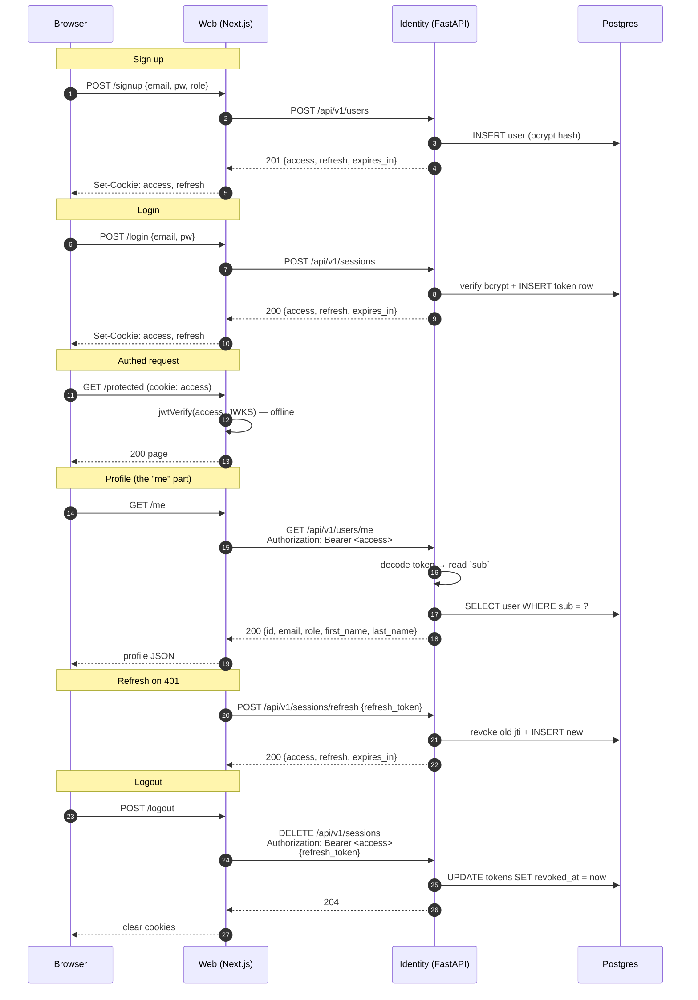
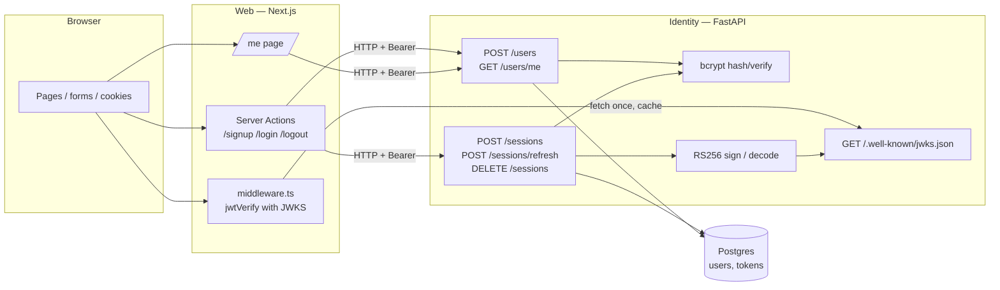
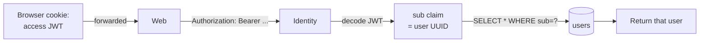

# Identity ↔ Web auth flow

## High level

## Components

## Why "me"

`me` is not session state inside identity — it's whatever `sub` the token carries.
Web is just a relay; identity authenticates each request from the token alone.

## Token lifetimes

| Token   | Lifetime | Where stored                   | Revocable? |
| ------- | -------- | ------------------------------ | ---------- |
| Access  | 15 min   | cookie (web), client memory    | No (short) |
| Refresh | 14 days  | cookie (web), `tokens` table   | Yes (jti)  |
