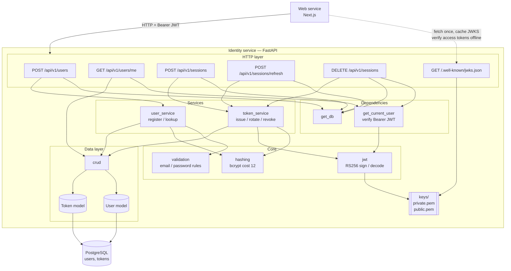

# Identity service — architecture

```mermaid
flowchart TB
    Web[Web service<br/>Next.js]

    subgraph Identity[Identity service — FastAPI]
        direction TB

        subgraph API[HTTP layer]
            R1[POST /api/v1/users]
            R2[GET  /api/v1/users/me]
            R3[POST /api/v1/sessions]
            R4[POST /api/v1/sessions/refresh]
            R5[DELETE /api/v1/sessions]
            R6[GET /.well-known/jwks.json]
        end

        subgraph Deps[Dependencies]
            GD[get_db]
            GU[get_current_user<br/>verify Bearer JWT]
        end

        subgraph Svc[Services]
            US[user_service<br/>register / lookup]
            TS[token_service<br/>issue / rotate / revoke]
        end

        subgraph Core[Core]
            HASH[hashing<br/>bcrypt cost 12]
            JWT[jwt<br/>RS256 sign / decode]
            VAL[validation<br/>email / password rules]
        end

        subgraph Data[Data layer]
            CRUD[crud]
            MU[(User model)]
            MT[(Token model)]
        end

        KEYS[[keys/<br/>private.pem<br/>public.pem]]
    end

    DB[(PostgreSQL<br/>users, tokens)]

    Web -->|HTTP + Bearer JWT| API
    Web -.->|fetch once, cache JWKS<br/>verify access tokens offline| R6

    R1 --> GD
    R2 --> GU
    R3 --> GD
    R4 --> GD
    R5 --> GU & GD

    R1 --> US
    R2 --> CRUD
    R3 --> TS
    R4 --> TS
    R5 --> TS

    GU --> JWT
    US --> VAL
    US --> HASH
    US --> CRUD
    TS --> HASH
    TS --> JWT
    TS --> CRUD

    JWT --> KEYS
    R6 --> KEYS

    CRUD --> MU
    CRUD --> MT
    MU --> DB
    MT --> DB
```
